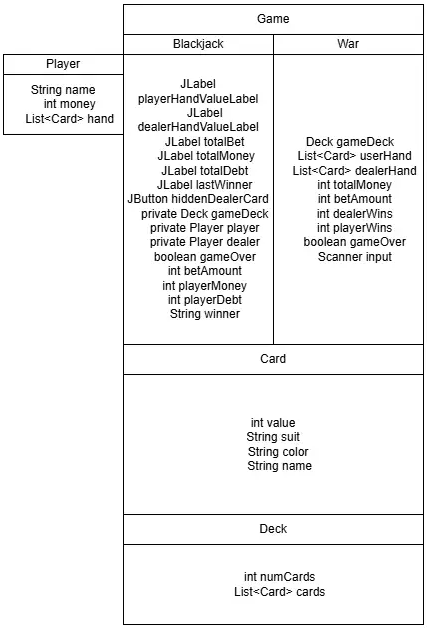
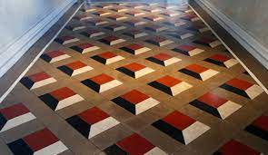

# Semester 1 Project

## Project Description
This project is a Java based casino game application developed as part of the CSA S1 P project. The program simulates a virtual casino environment where the player explores a lobby and accesses different games by controlling a character.

The casino currently includes two playable games: Blackjack and Casino War. Both games include betting features that allow the player to wager in game currency. The lobby serves as the central hub of the application and is the main file of the project. From the lobby, the player can travel through tunnels that open and connect to each game.

This project demonstrates object oriented programming, class interaction, game state management, and basic graphical rendering while allowing room for future expansion.

## Run Instructions
1. Ensure Java JDK 17 or later is installed
2. Clone or download the repository
3. Open the project in VS Code
4. Locate the Lobby class
5. Run the program from the Lobby file

Command line usage:
javac Lobby.java
java Lobby

## Features
- Playable Blackjack game with betting mechanics
- Playable Casino War game with betting mechanics
- Player controlled character movement
- Interactive lobby that connects all games
- Tunnel based system to enter and exit games
- Modular class structure designed for expansion
- Java Swing based graphics and input handling

## Class Diagram

## Lobby Design References

### Flooring Inspiration

### Initial Lobby Sketch

## Team Roles
Lead Programmer: Kaleb Fling  
Bug Tester: David Kostrinsky  

## Known Bugs
- Minor issues when transitioning between games through the lobby
- Some class connections need cleanup and refactoring
- The lobby is not yet fully implemented

## Future Improvements
- Fully implement and polish the lobby
- Clean up and refactor code and class connections
- Add Poker and Slots
- Implement full graphics for Casino War
- Improve visuals and animations

## Additional Notes
This project is still in development and will continue to expand as new features are added.
